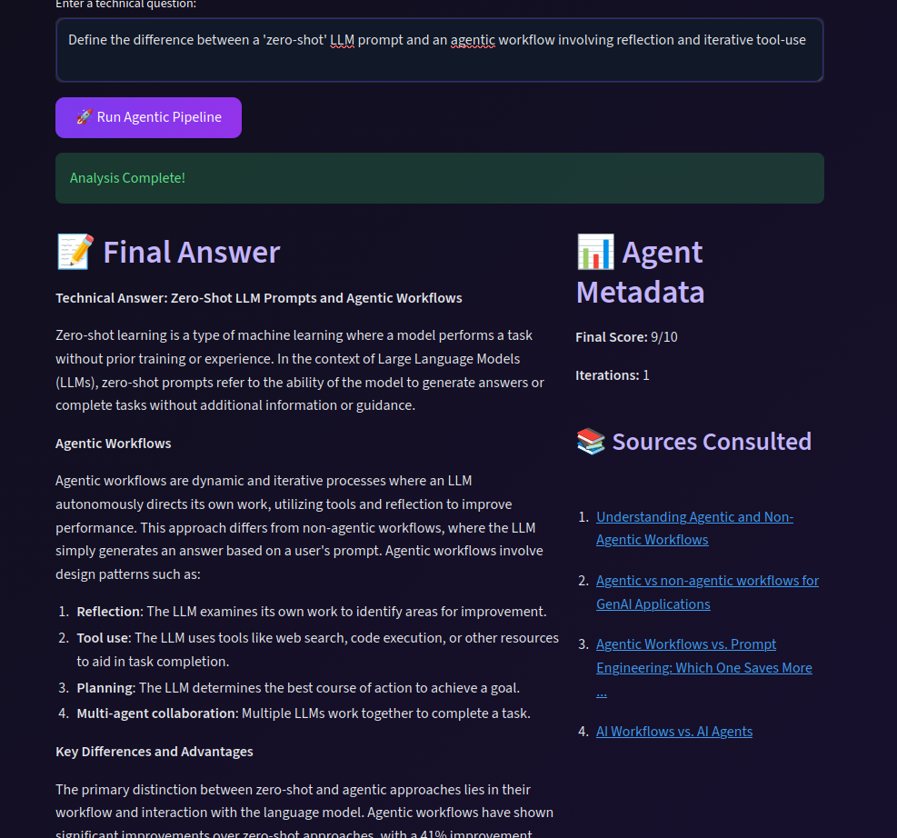

# 🤖 Autonomous Research Agent

An advanced **Agentic AI** system that autonomously researches technical topics by **planning, searching the web, writing structured reports, and self-evaluating** its own work. Built using **LangGraph** for stateful orchestration and **Ollama** for local privacy-focused inference.

---

## 🚀 Project Overview

This project moves beyond simple RAG (Retrieval-Augmented Generation) by implementing a multi-stage **agentic loop**. The agent doesn't just answer; it reasons through a workflow:

* **Dynamic Planning**: Deconstructs complex queries into logical sections.
* **Web Research**: Uses the Tavily API to fetch real-time, high-quality technical data.
* **Iterative Writing**: Drafts sections individually to maintain focus and reduce hallucinations.
* **Self-Correction**: An evaluator node scores the answer and can trigger a "re-plan" loop if quality is low.
* **Local-First Inference**: Optimized to run on **Llama 3.2** via Ollama for data privacy.

The focus is on **stateful orchestration**—ensuring the AI can "think" before it speaks and "verify" before it finishes.

---

## 🏗️ System Architecture

User Query
↓
**Planner Node** (Generates Section Titles)
↓
**Researcher Node** (Tavily Web Search)
↓
**Worker Node** (Drafts Technical Content)
↓
**Synthesizer Node** (Assembles Final Report)
↓
**Evaluator Node** (Scores 1-10)
├── Score < 7 → Back to **Planner** (Loop)
└── Score ≥ 7 → **Final Answer** (End)

---

## 🧠 Core Technologies & Design Decisions

### LangGraph Orchestration

Unlike linear chains, LangGraph allows for **cyclic graphs**. This is critical for "Research Agents" because it allows the system to realize it missed information and go back to the planning stage—simulating a human-like research process.

### Local LLM Integration (Ollama)

The system is configured to use **Llama 3.2 (3B)** locally. This decision balances:

* **Privacy**: No prompt data (except search queries) leaves your local machine.
* **Speed**: Optimized for local hardware without API rate limits.
* **Cost**: Zero inference cost compared to proprietary models.

### Real-time Web Intelligence

**Tavily AI** was selected as the search layer because it is specifically optimized for LLMs, returning cleaned content instead of raw HTML, which significantly reduces token noise in the context window.

---

## 📊 Agentic Workflow Logic

The agent follows a strict state-based execution:

| Phase | Responsibility | Tooling |
| --- | --- | --- |
| **Planning** | Break down question into sub-topics | Ollama (Llama 3.2) |
| **Research** | Gather evidence from the live web | Tavily API |
| **Writing** | Convert evidence into technical prose | Ollama (Llama 3.2) |
| **Evaluation** | Quality control and scoring | Ollama (Llama 3.2) |

---

## 🌐 Live Demo

🔗 **Demo Version (Cloud):** https://huggingface.co/spaces/Furqan09Ahmed/autonomous-research-agent

*(Note: Cloud version uses Groq Llama 3.3-70B for public performance; local version uses Ollama.)*

---

## 📸 Application Preview


### Input Interface


### Result


---

## ⚙️ Run Locally

Ensure you have [Ollama](https://ollama.com/) installed and running.

1. **Pull the Model:**
```bash
ollama pull llama3.2:3b

```


2. **Clone and Setup:**
```bash
git clone https://github.com/Furqan09Ahmed/autonomous-research-agent.git
cd autonomous-research-agent

python -m venv venv
source venv/bin/activate  # Windows: venv\Scripts\activate
pip install -r requirements.txt

```


3. **Environment Variables:**
Create a `.env` file and add your key:
```env
TAVILY_API_KEY=your_tavily_key_here

```


4. **Launch:**
```bash
streamlit run streamlit_app.py

```


---

## 🛠️ Tech Stack

* **Orchestration:** LangGraph
* **LLM Framework:** LangChain / Ollama
* **Local LLM:** Llama 3.2 (3B)
* **Search Engine:** Tavily AI
* **Web App:** Streamlit
* **Environment:** Python 3.10+

---

## 👤 Author

**Furqan Ahmed**

* 🌐 Portfolio: [https://FurqanAhmed.me](https://FurqanAhmed.me)
* 💻 GitHub: [https://github.com/Furqan09Ahmed](https://github.com/Furqan09Ahmed)
* 🔗 LinkedIn: [https://www.linkedin.com/in/Furqan09Ahmed](https://www.linkedin.com/in/Furqan09Ahmed)

---
